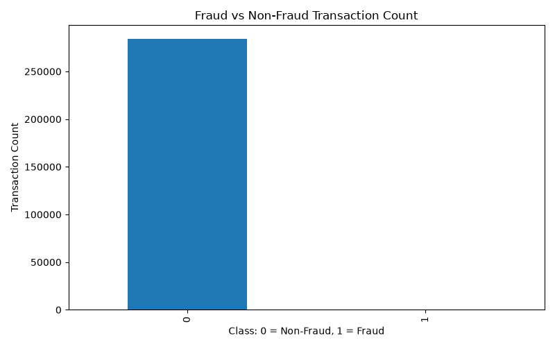
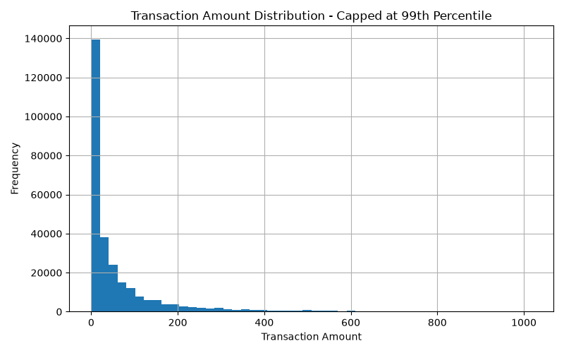

# Real-Time Fraud Detection Pipeline

## Project Overview
This project builds a near-real-time fraud detection analytics pipeline using real anonymized credit card transaction data, SQL, Python, machine learning, and BI-style reporting.

## Business Problem
Financial institutions process large volumes of transactions every day. Fraud and risk teams need scalable analytics to identify suspicious activity, reduce fraud exposure, and prioritize transactions for operational review.

## Dataset
This project uses the Credit Card Fraud Detection dataset from Kaggle.

The dataset contains anonymized credit card transactions made by European cardholders in September 2013. It includes 284,807 transactions and 492 fraud transactions, making it a highly imbalanced fraud detection dataset.

Raw data is stored locally and is not pushed to GitHub.

## Tools and Technologies
- Python
- Pandas
- NumPy
- Scikit-learn
- SQL
- Matplotlib
- GitHub
- BI Dashboard Planning

## Project Workflow
1. Loaded real transaction data
2. Cleaned and validated transaction records
3. Analyzed fraud vs non-fraud transaction patterns
4. Built fraud KPI reports
5. Created fraud monitoring SQL queries
6. Built baseline fraud detection model
7. Generated business reports and charts
8. Prepared dashboard requirements for fraud operations

## Key Results
| Metric | Value |
|---|---:|
| Total Transactions | 284,807 |
| Fraud Transactions | 492 |
| Fraud Rate | 0.1727% |
| Total Fraud Amount | $60,127.97 |
| Average Fraud Amount | $122.21 |
| Average Non-Fraud Amount | $88.29 |
| Model Precision | 0.0625 |
| Model Recall | 0.8862 |
| Model F1 Score | 0.1168 |
| Model ROC AUC | 0.9726 |

## Business Interpretation
The dataset is highly imbalanced, which is common in fraud analytics. The baseline model achieved strong recall, meaning it was able to capture a large portion of fraud cases. Precision is low, which means the model would still require tuning to reduce false positives and lower manual review volume.

## Dashboard and Reporting Outputs
- Fraud KPI report: reports/fraud_kpis.csv
- Model metrics report: reports/model_metrics.csv
- Business analysis report: reports/fraud_analysis_report.md
- Fraud class distribution chart: images/fraud_class_distribution.png
- Transaction amount distribution chart: images/transaction_amount_distribution.png

## Sample Visuals

## Repository Structure
- data: dataset instructions only
- src: reusable Python analysis scripts
- sql: fraud monitoring SQL queries
- reports: KPI and model output reports
- images: generated charts
- dashboards: dashboard requirement documentation
- docs: data dictionary and project documentation

## Business Impact
This project demonstrates how fraud analytics can support risk teams by identifying suspicious transaction activity, measuring fraud exposure, and creating monitoring dashboards for operational decision-making.

## Future Improvements
- Add advanced models such as Random Forest or XGBoost
- Add threshold tuning to improve precision
- Add model drift monitoring
- Build final Power BI or Tableau dashboard
- Simulate streaming fraud alerts using scheduled batch scoring
